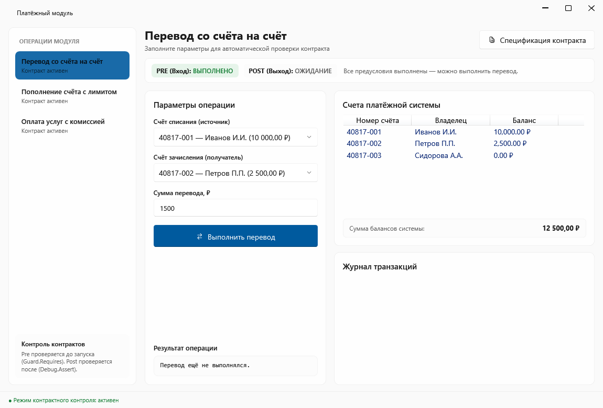
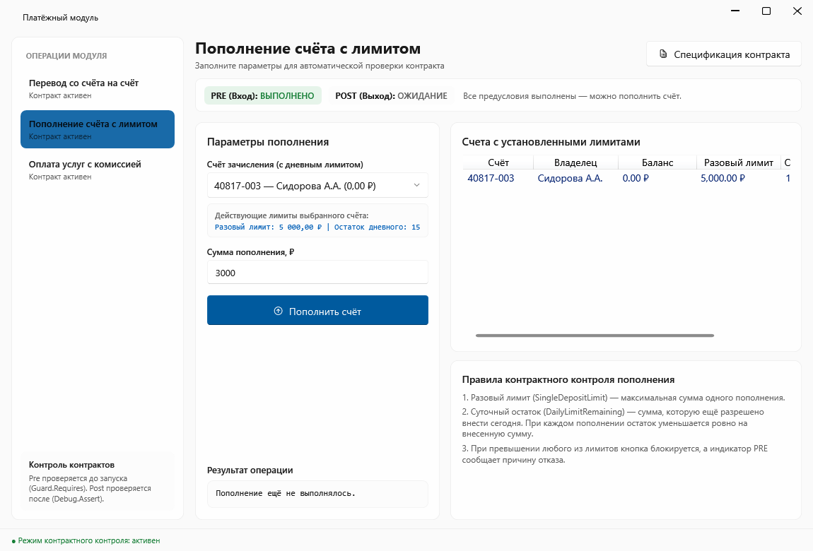
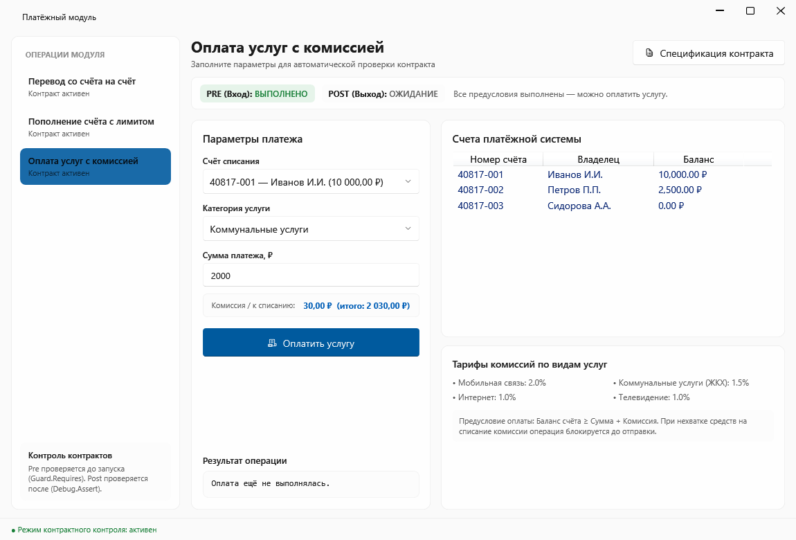
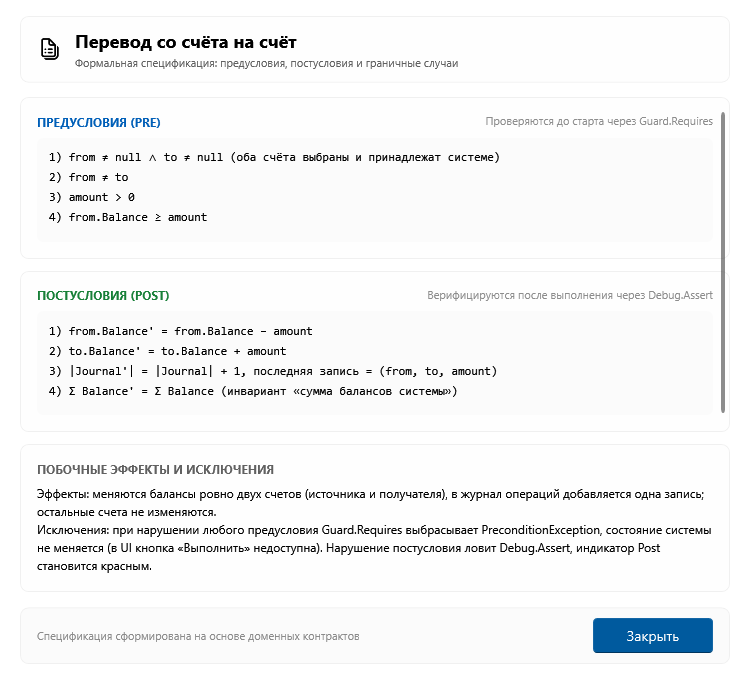

# Платёжный модуль с формальной верификацией контрактов

Учебный научно-практический проект по дисциплине «Технологии разработки программного обеспечения»  
**ТвГТУ, группа Б.ПИН.ИИ.25.16**

| Параметр | Спецификация |
|:---|:---|
| **Версия проекта** | `v1.0.0` (Лабораторная работа №1) |
| **Язык программирования** | C# 12.0 (Nullable Reference Types, Records, Pattern Matching) |
| **Целевая платформа** | .NET 8.0 LTS (`net8.0`, `net8.0-windows`) |
| **Графическая подсистема** | Windows Presentation Foundation (WPF), `WPF-UI` 4.3.0 |
| **СУБД и провайдер данных** | SQLite 3, `Microsoft.Data.Sqlite` 10.0.12 |
| **Фреймворк тестирования** | xUnit 2.5.3, `Microsoft.NET.Test.Sdk` 17.8.0 |
| **Архитектурный шаблон** | MVVM (Model-View-ViewModel), Design by Contract (DbC) |

---

## Введение

Программный комплекс представляет собой десктопное приложение для выполнения расчётно-кассовых операций (переводы, пополнение с лимитом, оплата услуг с тарифицируемой комиссией). В основу архитектуры положена методология **проектирования по контракту** (*Design by Contract, DbC*), совмещённая с шаблоном **MVVM** и реляционной персистентностью на базе **SQLite**.

**Ключевая особенность:** непрерывный контроль контрактов в графическом интерфейсе:
* **Предусловия (Pre):** проверяются «на лету» без побочных эффектов. При нарушении Pre кнопка выполнения блокируется, а индикатор отображает причину ошибки. Доменный барьер контролируется классом `Guard.Requires(...)`.
* **Постусловия (Post):** верифицируются сразу после мутации состояния через диагностические утверждения `Debug.Assert(...)` и флаги в иммутабельных снимках результатов.
* **Инварианты (Inv):** обеспечивают целостность системы (неотрицательность балансов, сохранение суммарного баланса при межбанковском переводе).
* **Спецификация:** модальное окно «Показать контракт» отображает формальные предикаты, исключения, побочные эффекты и граничные тестовые примеры.

---

## Состав группы

| № | Участник | Роль | Вклад в проект |
|:---:|:---|:---|:---|
| 1 | **Ясенков Никита** | Тимлид, архитектор | Архитектурный каркас, инфраструктура MVVM (`ViewModelBase`, `RelayCommand`), барьер `Guard`, главное окно `MainWindow` и окно спецификаций `ContractWindow` |
| 2 | **Иришин Тимофей** | Разработчик | Операция 1 («Перевод со счёта на счёт»): математическая спецификация, доменная логика, UI, контроль межбалансового инварианта |
| 3 | **Пестов Михаил** | Разработчик | Операция 2 («Пополнение счёта с лимитом»): сущность `DailyLimitAccount`, доменная логика, UI, двухфакторный контроль разового и суточного лимитов |
| 4 | **Воронова Анфиса** | Разработчик | Операция 3 («Оплата услуг с комиссией»): тарификатор комиссий, банковское округление, доменная логика и UI |
| 5 | **Груздев Андрей** | Аналитик | Формализация предикатов, теоретическое обоснование исчисления Хоара и семантики Дейкстры, оформление отчётности |
| 6 | **Кукушкин Андрей** | QA-инженер | Разработка автоматизированного набора из 50 модульных тестов на xUnit, анализ граничных значений и классов эквивалентности |

---

## Краткая суть операций модуля

| Операция | Входные данные | Предусловия (Pre) | Постусловия (Post) и инварианты (Inv) |
|:---|:---|:---|:---|
| **1. Перевод со счёта на счёт** | `from`, `to`, `amount` | `from ≠ to`,<br>`amount > 0`,<br>`from.Balance ≥ amount` | `from.Balance' = from.Balance - amount`<br>`to.Balance' = to.Balance + amount`<br>`Σ(Balance') = Σ(Balance)` *(инвариант)* |
| **2. Пополнение с лимитом** | `account`, `amount` | `amount > 0`,<br>`amount ≤ SingleDepositLimit`,<br>`amount ≤ DailyLimitRemaining` | `account.Balance' = account.Balance + amount`<br>`account.DailyLimitRemaining' = DailyLimitRemaining - amount` |
| **3. Оплата услуг с комиссией** | `account`, `service`, `amount` | `service выбрана`,<br>`amount > 0`,<br>`account.Balance ≥ amount + commission` | `account.Balance' = account.Balance - (amount + commission)`<br>статус = «Оплачено» |

*Пояснение:* `commission = round(amount × ставка_услуги, 2)` (Интернет 1%, Мобильная связь 2%, ЖКХ 1.5%, ТВ 1%).

---

## Скриншоты интерфейса

### 1. Перевод со счёта на счёт
Динамический контроль предусловий (Pre) при вводе суммы перевода и проверка межбалансового инварианта системы:


### 2. Пополнение счёта с лимитом
Двухфакторная проверка допустимости операции (разовый лимит и остаток дневного лимита):


### 3. Оплата услуг с комиссией
Автоматический расчёт комиссии и проверка достаточности баланса для списания `сумма + комиссия`:


### 4. Модальное окно спецификации контракта
Формальная спецификация с перечислением предусловий, постусловий, побочных эффектов, исключений и граничных примеров:


---

## Математическое пояснение

Корректность операций формализована классической **тройкой Хоара**:

```text
{P}  C  {Q}
```
* **P (Pre, предусловие):** предикат состояния до выполнения операции.
* **C (Command, операция):** исполняемый код метода доменного слоя.
* **Q (Post, постусловие):** гарантированный предикат состояния после завершения операции.

В семантике **слабейших предусловий Дейкстры (wp)** предусловие `P` корректно тогда и только тогда, когда оно гарантирует выполнение постусловия `Q`:  
`P ⇒ wp(C, Q)`, где для оператора присваивания `wp(x := E, Q) = Q[x ← E]`.

### Формальные спецификации операций

* **1. Перевод (Transfer):**
  * **Pre:** `from ≠ to ∧ amount > 0 ∧ from.Balance ≥ amount`
  * **Post:** `from.Balance' = from.Balance - amount ∧ to.Balance' = to.Balance + amount`
  * **Инвариант:** `Σ(Balance') = Σ(Balance)` (сохранение суммарного баланса системы)

* **2. Пополнение с лимитом (Deposit):**
  * **Pre:** `amount > 0 ∧ amount ≤ SingleDepositLimit ∧ amount ≤ DailyLimitRemaining`
  * **Post:** `Balance' = Balance + amount ∧ DailyLimitRemaining' = DailyLimitRemaining - amount`

* **3. Оплата услуг с комиссией (PayService):**
  * **Pre:** `service ∈ Каталог ∧ amount > 0 ∧ Balance ≥ amount + commission`  
    *(где `commission = round(amount × rate, 2)`)*
  * **Post:** `Balance' = Balance - (amount + commission) ∧ Status = "Оплачено"`

---

## Установка и запуск

### Требования к окружению
* **Операционная система:** Windows 10 / 11 (x64)
* **Платформа сборки:** .NET SDK 8.0 (версия 8.0.100+)
* **Среда разработки (IDE):** Visual Studio 2022 (v17.8+) / JetBrains Rider 2023.3+ / VS Code с C# Dev Kit
* **Ключевые пакеты NuGet:**
  * `WPF-UI` — версия 4.3.0
  * `Microsoft.Data.Sqlite` — версия 10.0.12
  * `xunit` — версия 2.5.3
  * `Microsoft.NET.Test.Sdk` — версия 17.8.0

### Инструкция по шагам

1. **Клонировать репозиторий:**
   ```bash
   git clone https://github.com/nevollwar/PaymentModule.git
   cd PaymentModule
   ```

2. **Собрать проект:**
   ```bash
   dotnet build PaymentApp.sln -c Release
   ```

3. **Запустить модульные тесты (50 тестов xUnit):**
   ```bash
   dotnet test tests/PaymentApp.Tests/PaymentApp.Tests.csproj
   ```

4. **Запустить приложение:**
   ```bash
   dotnet run --project src/PaymentApp.UI/PaymentApp.UI.csproj
   ```
